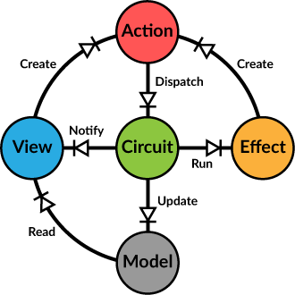

# 

# Introduction

Diode was born out of the need of having something similar to Redux or Om for Scala applications. It's a very simple but powerful library with three basic
tenets:

1. Model is your state, keep no other state
2. Thou shall not directly modify the state
3. State is always replaced with the next state

If you are interested in the motivation, or prior art for Diode, we recommend reading through 
[Redux introduction](http://rackt.org/redux/docs/introduction/index.html) and [Flux architecture](https://facebook.github.io/flux/docs/overview.html#content).
Both give a great overview on the benefits of unidirectional data flow and immutable state.

To use Diode in your application add following dependency declaration to your Scala project.

<pre><code class="lang-scala">"me.chrons" %% "diode" % "{{ book.version }}"</code></pre>

In a Scala.js project the dependency looks like this.

<pre><code class="lang-scala">"me.chrons" %%% "diode" % "{{ book.version }}"</code></pre>

## Diode Architecture

The building blocks and data flow of a Diode application are shown in the diagram below.

The **Model** represents the full state of your application. You should be able to serialize the model, restart the application, deserialize the model and you
would end up in the exact same state where you started. Typically the model is constructed as a hierarchy of case classes, but it can be anything that resembles
a directed graph.

To make a change in the **Model** you need to create and dispatch an **Action**. An action is an immutable data object containing information on how the state
should be changed. 

All actions are processed by a single **Circuit**, containing handlers for different action types. The responsibility of an action handler is to calculate a new
model based on the previous model and the action. It can be represented as a function `(model, action) => model`. In addition to the updated model, the handler
may also return one or more async **Effect**s.

These **Effect**s are meant for performing side effects such as loading data from the server. When an effect completes, it must return a new action to be
dispatched. This ensures that all changes to the model happen synchronously inside the **Circuit**.

The circuit notifies registered **View**s about all changes to the application model. Views may then _read_ from the model any data they need for rendering.
User interaction creates new **Action**s that go through the now familiar processing loop.

